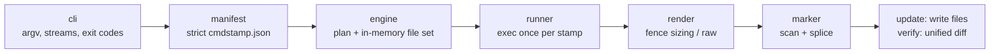

# cmdstamp

[English](README.md) | [中文](README.zh.md) | [日本語](README.ja.md)

[](LICENSE) [](go.mod) [](CHANGELOG.md)  [](CONTRIBUTING.md)

**cmdstamp：CLI 作者のためのオープンソースなドキュメント鮮度維持ツール——ドキュメントが引用するコマンドを 1 つのマニフェストに宣言し、実際の出力をマーカー領域にスタンプし、ずれた瞬間にビルドを失敗させる。**


```bash
git clone https://github.com/JaydenCJ/cmdstamp.git && cd cmdstamp && go install ./cmd/cmdstamp
```

> プレリリース：v0.1.0 はまだ module proxy tag として公開されていないため、上記の手順でソースからインストールしてください。単一の静的バイナリで、ランタイム依存はゼロです。

## なぜ cmdstamp？

どの CLI の README も自身の `--help` を引用していますが、その多くは手作業の貼り付けです——つまり 2 リリース後にはひっそり間違っています：改名されたフラグ、追加されたサブコマンド、書き直された usage 文。何も失敗しないので誰も気づきません。定番の解決策である cog は、各ファイルのコメントブロックに Python の生成コードを埋め込む方式なので、ドキュメントに言語依存が生まれ、生成ロジックは生成先のドキュメントのあちこちに散らばります。cmdstamp はこれを逆転させます：ファイルには不活性で言語中立な名前マーカー（`<!-- cmdstamp:begin cli-help -->` … `end`）だけを置き、どのコマンドがどの領域に流れ込むかは 1 つの厳格な JSON マニフェストが宣言します——実行ファイルなら何でも、どの言語でも、argv でもシェルパイプラインでも。`update` は各コマンドを一度だけ実行して出力を継ぎ込み、`verify` は同じコマンドを実行してドキュメントが現実と一致しなくなった時点で unified diff 付きの終了コード 1 で失敗します。「古びたドキュメント」がテスト失敗と同じ硬いゲートになるのです。

| | cmdstamp | cog | mdsh | embedme |
| --- | --- | --- | --- | --- |
| 生成ロジックの置き場所 | 1 つの JSON マニフェスト | 各ファイルに埋め込まれた Python コード | ファイルごとにインラインの `$ command` 行 | 該当なし（出力でなくファイルを埋め込む） |
| ドキュメント内のマーカー | 不活性な名前タグ、3 種のコメント記法 | 実行される Python ブロック | 実行されるフェンス注釈 | ファイルパス付きフェンス |
| あなたの CLI を実行 | 任意の実行ファイル、argv または `sh -c` | 自分で書く Python 経由 | 可 | 不可 |
| ドリフトゲート | `verify`：終了コード 1 + 領域ごとの unified diff | `cog --check` | `--frozen` | `--verify` |
| 1 コマンド → 複数ファイル | 可、実行は正確に 1 回 | 不可——コードはファイルごと | 不可——ブロックごと | 該当なし |
| 必要なランタイム | 単一の静的 Go バイナリ | Python + cogapp | Rust バイナリ | Node.js |

<sub>比較は 2026-07 時点の各上流ドキュメントに基づく。cog のインラインコード方式はより強力（任意の生成が可能）——cmdstamp は意図的にそれを捨て、コードを一切含まないドキュメントと、一箇所でレビューできるマニフェストを取った。</sub>

## 特徴

- **マーカーはロジックを持たない** — 領域は HTML・`#`・`//` コメント記法（自動判別）の名前タグにすぎず、同じマーカーが Markdown、YAML サンプル、シェルスクリプト、Go ソースで通用します；実行に関するすべては `cmdstamp.json` に住んでいます。
- **ゲートのために作られた verify モード** — `cmdstamp verify` は宣言済みコマンドを再実行し、領域ごとの unified diff とともに終了コード 1 で失敗します；pre-push フックやリリースチェックリストに組み込めば、貼り付けた出力が静かに腐ることは二度とありません。
- **厳格なマニフェスト** — 未知のキー、絶対パス、`..` による脱出、`command`/`shell` の衝突、範囲外の終了コード：すべてロード時のハードエラーです。「タイポのせいでドキュメントが静かに再生成されなくなる」ことこそ、このツールが治す病気だからです。
- **エスケープ不能なレンダリング** — `code` フォーマットは出力中のどのバッククォート連よりも厳密に長いフェンスを選び（``` を印字するコマンドもブロックから抜け出せません）、`raw` フォーマットはコマンドが生成した Markdown をそのまま挿入し、内部の行を整形することはありません。
- **書くなら全部、さもなくば何も** — 各 stamp のコマンドは正確に 1 回だけ実行され、ファイルはメモリ上で継ぎ合わされ、すべてのコマンドが成功するまで何も書き込まれません；マーカー行と領域外の全バイトは正確に保存されます。
- **依存ゼロ、ネットワークゼロ** — 純粋な Go 標準ライブラリ、静的バイナリ 1 つ；cmdstamp はあなたが宣言したコマンドを実行し、宣言したファイルに触れるだけで、それ以外は何もしません。88 個のオフラインテストとエンドツーエンドのスモークスクリプトで検証済みです。

## クイックスタート

README が引用するコマンドを `cmdstamp.json` に宣言します：

```json
{
  "version": 1,
  "stamps": {
    "cli-help": {
      "command": ["./mytool", "--help"],
      "files": ["README.md"],
      "lang": "text"
    }
  }
}
```

出力が現れるべき場所にマーカーの対を置き、スタンプします：

```bash
cmdstamp update
```

実際にキャプチャした出力：

```text
stamped    README.md#cli-help
1 region: 1 stamped, 0 unchanged
```

領域にはツールの本物のヘルプテキストがフェンス付きで収まり、コミットできます：

````markdown
<!-- cmdstamp:begin cli-help -->
```text
usage: mytool [--help] [pack|unpack] FILE
  pack FILE     bundle FILE into an archive
  unpack FILE   restore an archive
```
<!-- cmdstamp:end cli-help -->
````

次のリリースでヘルプテキストが変わると、`cmdstamp verify` がそれを捕まえます（実際の出力、終了コード 1）：

```text
stale   README.md#cli-help
        --- README.md#cli-help (stored)
        +++ README.md#cli-help (fresh)
        @@ -1,5 +1,5 @@
         ```text
         usage: mytool [--help] [pack|unpack] FILE
           pack FILE     bundle FILE into an archive
        -  unpack FILE   restore an archive
        +  unpack FILE   restore FILE from an archive
         ```
1 region: 0 ok, 1 stale
run `cmdstamp update` to restamp
```

`cmdstamp update` で再スタンプすると、ドキュメントの変更は `git diff` に現れ、他のコード変更と同じようにレビューできます。完全なミニチュアプロジェクトは [examples/](examples/README.md) にあります。

## マニフェストリファレンス

各 stamp は 1 つのコマンドを同名の領域へ対応付けます。フィールド：

| キー | デフォルト | 効果 |
| --- | --- | --- |
| `command` | — | argv 配列、直接実行（シェルなし、クォートの落とし穴なし） |
| `shell` | — | パイプライン用の `sh -c` コマンドライン；`command` と排他 |
| `files` | 必須 | 領域を含むドキュメント；パスはマニフェスト基準の相対 |
| `format` | `"code"` | `"code"` は出力をフェンスで包み、`"raw"` は Markdown をそのまま挿入 |
| `lang` | `""` | フェンスの info 文字列（`text`、`console` など）；`code` 専用 |
| `dir` | マニフェストのディレクトリ | コマンドの作業ディレクトリ |
| `env` | `{}` | 追加の環境変数 |
| `stream` | `"stdout"` | `"stdout"`・`"stderr"`・`"combined"` を捕捉 |
| `exit` | `0` | 期待する終了コード——`--help` が 2 で終わるツールも宣言可能 |
| `trim` | `true` | 出力末尾の空行を落とす |

`cmdstamp scan` は全マーカー領域の行範囲と状態（`declared` / `undeclared` / `missing`）を一覧し、`cmdstamp list` は宣言済み stamp を表示します。終了コード：`0` 正常、`1` 古い領域あり（verify）、`2` 用法/マニフェスト/コマンドのエラー。完全な文法と継ぎ合わせ規則：[docs/format.md](docs/format.md)。

## アーキテクチャ



`update` は左から右へ流れて書き込みで終わり、`verify` は完全に同じ経路を辿って diff で終わります——2 つのモードが「新鮮さ」の定義で食い違うことはあり得ません。

## ロードマップ

- [x] v0.1.0 — update/verify/list/scan/init、3 種のマーカー記法、厳格なマニフェスト（argv/shell、dir、env、stream、exit、trim）、エスケープ不能なコードフェンス、raw Markdown モード、stamp ごとに 1 回だけの実行、全か無かの書き込み、88 テスト + スモークスクリプト
- [ ] `--jobs N` による大規模マニフェストの並列実行
- [ ] 出力中のバージョン/日付を安定化させる領域単位の `replace` ルール
- [ ] CI アノテーション向けの機械可読レポート `verify --json`
- [ ] ファイルから領域内容を取り込む（`source` stamp）設定抜粋対応
- [ ] Windows 対応：CRLF を保存する継ぎ合わせとパス処理

全リストは [open issues](https://github.com/JaydenCJ/cmdstamp/issues) を参照してください。

## コントリビュート

バグ報告、マニフェストフィールドの提案、pull request を歓迎します——ローカルのワークフローは [CONTRIBUTING.md](CONTRIBUTING.md) を参照（`go test ./...` と `SMOKE OK` を印字する `scripts/smoke.sh`）。入門しやすい課題には [good first issue](https://github.com/JaydenCJ/cmdstamp/issues?q=is%3Aissue+is%3Aopen+label%3A%22good+first+issue%22) のラベルがあり、設計の議論は [Discussions](https://github.com/JaydenCJ/cmdstamp/discussions) で行っています。

## ライセンス

[MIT](LICENSE)
