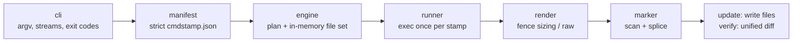

# cmdstamp

[English](README.md) | [中文](README.zh.md) | [日本語](README.ja.md)

[](LICENSE) [](go.mod) [](CHANGELOG.md)  [](CONTRIBUTING.md)

**cmdstamp：an open-source doc-freshness tool for CLI authors — declare the commands your docs quote in one manifest, stamp their real output into marked regions, and fail the build the moment it drifts.**


```bash
git clone https://github.com/JaydenCJ/cmdstamp.git && cd cmdstamp && go install ./cmd/cmdstamp
```

> Pre-release: v0.1.0 is not yet published to a module proxy tag; install from source as above. A single static binary, no runtime dependencies.

## Why cmdstamp?

Every CLI README quotes its own `--help`, and most of those quotes are hand-pasted — which means they are quietly wrong two releases later: a renamed flag, a new subcommand, reworded usage text, and nobody notices because nothing fails. The classic fix, cog, works by embedding Python generator code inside comment blocks in every file, so your documentation grows a language dependency and your generator logic is scattered across the docs it generates. cmdstamp inverts that: files carry only inert, language-neutral name markers (`<!-- cmdstamp:begin cli-help -->` … `end`), and a single strict JSON manifest declares which command feeds which region — any executable, any language, argv or shell pipeline. `update` runs each command once and splices the output in; `verify` runs the same commands and exits 1 with a unified diff when the docs no longer match reality, which makes "stale docs" a failing gate exactly like a failing test.

| | cmdstamp | cog | mdsh | embedme |
| --- | --- | --- | --- | --- |
| Generator logic lives in | one JSON manifest | Python code inline in every file | `$ command` lines inline per file | n/a (embeds files, not output) |
| Markers in your docs | inert name tags, 3 comment styles | executable Python blocks | executable fence annotations | fence with a file path |
| Runs your CLI | any executable, argv or `sh -c` | via Python you write | yes | no |
| Drift gate | `verify`: exit 1 + unified diff per region | `cog --check` | `--frozen` | `--verify` |
| One command → many files | yes, executed exactly once | no — code is per-file | no — per-block | n/a |
| Runtime needed | single static Go binary | Python + cogapp | Rust binary | Node.js |

<sub>Comparison reflects upstream documentation as of 2026-07. cog's inline-code model is more powerful (arbitrary generation) — cmdstamp deliberately trades that for docs that contain no code and a manifest you can review in one place.</sub>

## Features

- **Markers carry no logic** — regions are named tags in HTML, `#` or `//` comment style (auto-detected), so the same markers work in Markdown, YAML samples, shell scripts and Go sources; everything about execution lives in `cmdstamp.json`.
- **Verify mode, built to gate** — `cmdstamp verify` re-runs the declared commands and exits 1 with a per-region unified diff; wire it into a pre-push hook or release checklist and pasted output can never silently rot again.
- **A strict manifest** — unknown keys, absolute paths, `..` escapes, conflicting `command`/`shell`, out-of-range exit codes: all hard errors at load time, because a typo that silently stops regenerating docs is the exact disease this tool treats.
- **Escape-proof rendering** — `code` format sizes the fence strictly longer than any backtick run in the output (a command printing ``` cannot break out), `raw` format inserts command-generated Markdown verbatim, and interior lines are never prettified.
- **All-or-nothing writes** — each command runs exactly once per stamp, files are spliced in memory, and nothing is written until every command succeeds; marker lines and all bytes outside regions are preserved exactly.
- **Zero dependencies, zero network** — pure Go stdlib, one static binary; cmdstamp runs the commands you declared and touches the files you declared, nothing else, verified by 88 offline tests plus an end-to-end smoke script.

## Quickstart

Declare the command your README quotes, in `cmdstamp.json`:

```json
{
  "version": 1,
  "stamps": {
    "cli-help": {
      "command": ["./mytool", "--help"],
      "files": ["README.md"],
      "lang": "text"
    }
  }
}
```

Drop a marker pair where the output belongs, then stamp it:

```bash
cmdstamp update
```

Real captured output:

```text
stamped    README.md#cli-help
1 region: 1 stamped, 0 unchanged
```

The region now holds your tool's real help text, fenced and committed:

````markdown
<!-- cmdstamp:begin cli-help -->
```text
usage: mytool [--help] [pack|unpack] FILE
  pack FILE     bundle FILE into an archive
  unpack FILE   restore an archive
```
<!-- cmdstamp:end cli-help -->
````

Next release, the help text changes and `cmdstamp verify` catches it (real output, exit code 1):

```text
stale   README.md#cli-help
        --- README.md#cli-help (stored)
        +++ README.md#cli-help (fresh)
        @@ -1,5 +1,5 @@
         ```text
         usage: mytool [--help] [pack|unpack] FILE
           pack FILE     bundle FILE into an archive
        -  unpack FILE   restore an archive
        +  unpack FILE   restore FILE from an archive
         ```
1 region: 0 ok, 1 stale
run `cmdstamp update` to restamp
```

`cmdstamp update` restamps it and the doc change shows up in `git diff`, reviewable like any other. A full miniature project lives in [examples/](examples/README.md).

## Manifest reference

Each stamp maps one command to the regions bearing its name. Fields:

| Key | Default | Effect |
| --- | --- | --- |
| `command` | — | argv array, executed directly (no shell, no quoting pitfalls) |
| `shell` | — | `sh -c` command line for pipelines; mutually exclusive with `command` |
| `files` | required | documents containing the region; paths relative to the manifest |
| `format` | `"code"` | `"code"` wraps output in a fence, `"raw"` inserts Markdown verbatim |
| `lang` | `""` | fence info string (`text`, `console`, …); `code` format only |
| `dir` | manifest dir | working directory for the command |
| `env` | `{}` | extra environment variables |
| `stream` | `"stdout"` | capture `"stdout"`, `"stderr"` or `"combined"` |
| `exit` | `0` | expected exit code — tools whose `--help` exits 2 stay declarable |
| `trim` | `true` | drop trailing blank lines from the output |

`cmdstamp scan` inventories every marked region with line spans and status (`declared` / `undeclared` / `missing`), and `cmdstamp list` shows the declared stamps. Exit codes: `0` ok, `1` stale (verify), `2` usage/manifest/command error. Full grammar and splice rules: [docs/format.md](docs/format.md).

## Architecture



`update` flows left to right and ends in writes; `verify` takes the identical path but ends in diffs — the two modes can never disagree about what "fresh" means.

## Roadmap

- [x] v0.1.0 — update/verify/list/scan/init, 3 marker styles, strict manifest (argv/shell, dir, env, stream, exit, trim), escape-proof code fences, raw Markdown mode, once-per-stamp execution, all-or-nothing writes, 88 tests + smoke script
- [ ] `--jobs N` parallel command execution for large manifests
- [ ] Region-level `replace` rules to stabilize versions/dates in output
- [ ] `verify --json` machine-readable report for CI annotation
- [ ] Capturing region content from files (`source` stamps) for config excerpts
- [ ] Windows support: CRLF-preserving splices and path handling

See the [open issues](https://github.com/JaydenCJ/cmdstamp/issues) for the full list.

## Contributing

Bug reports, manifest-field proposals and pull requests are welcome — see [CONTRIBUTING.md](CONTRIBUTING.md) for the local workflow (`go test ./...` plus `scripts/smoke.sh` printing `SMOKE OK`). Good entry points are labelled [good first issue](https://github.com/JaydenCJ/cmdstamp/issues?q=is%3Aissue+is%3Aopen+label%3A%22good+first+issue%22), and design questions live in [Discussions](https://github.com/JaydenCJ/cmdstamp/discussions).

## License

[MIT](LICENSE)
