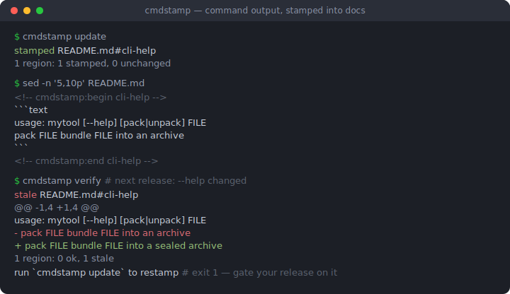
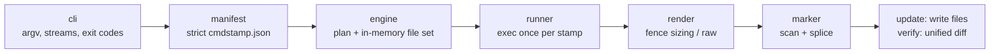

# cmdstamp

[English](README.md) | [中文](README.zh.md) | [日本語](README.ja.md)

[](LICENSE) [](go.mod) [](CHANGELOG.md)  [](CONTRIBUTING.md)

**cmdstamp：一款面向 CLI 作者的开源文档保鲜工具——在一份清单里声明文档所引用的命令，把真实输出盖章写入标记区域，一旦漂移立刻让构建失败。**



```bash
git clone https://github.com/JaydenCJ/cmdstamp.git && cd cmdstamp && go install ./cmd/cmdstamp
```

> 预发布：v0.1.0 尚未发布 module proxy tag，请按上述方式从源码安装。单个静态二进制，零运行时依赖。

## 为什么选 cmdstamp？

每个 CLI 的 README 都会引用自己的 `--help`，而这些引用大多是手工粘贴的——也就是说两个版本之后它们就悄悄错了：一个改名的 flag、一个新增的子命令、一段重写的用法说明，而且因为没有任何东西失败，谁也不会注意到。经典的解决方案 cog 的做法是把 Python 生成代码嵌进每个文件的注释块里，于是你的文档多出了一个语言依赖，生成逻辑也散落在被它生成的文档各处。cmdstamp 反其道而行：文件里只放惰性的、语言中立的名字标记（`<!-- cmdstamp:begin cli-help -->` … `end`），一份严格的 JSON 清单声明哪条命令喂给哪个区域——任何可执行文件、任何语言、argv 或 shell 管道皆可。`update` 把每条命令只跑一次并将输出拼接进去；`verify` 跑同样的命令，一旦文档与现实不再一致就以退出码 1 附统一 diff 报错，让"文档过期"像测试失败一样成为一道硬门禁。

| | cmdstamp | cog | mdsh | embedme |
| --- | --- | --- | --- | --- |
| 生成逻辑存放于 | 一份 JSON 清单 | 内嵌在每个文件里的 Python 代码 | 逐文件内联的 `$ command` 行 | 不适用（嵌入文件而非输出） |
| 文档中的标记 | 惰性名字标签，3 种注释风格 | 可执行的 Python 块 | 可执行的围栏注解 | 带文件路径的围栏 |
| 运行你的 CLI | 任意可执行文件，argv 或 `sh -c` | 通过你自己写的 Python | 支持 | 不支持 |
| 漂移门禁 | `verify`：退出码 1 + 逐区域统一 diff | `cog --check` | `--frozen` | `--verify` |
| 一条命令 → 多个文件 | 支持，且只执行一次 | 不支持——代码逐文件存在 | 不支持——逐代码块 | 不适用 |
| 所需运行时 | 单个静态 Go 二进制 | Python + cogapp | Rust 二进制 | Node.js |

<sub>对比基于 2026-07 各上游文档。cog 的内联代码模型更强大（可任意生成）——cmdstamp 有意用它换取不含任何代码的文档，以及一份可以在同一处审阅的清单。</sub>

## 特性

- **标记不承载逻辑** — 区域只是 HTML、`#` 或 `//` 注释风格（自动识别）的名字标签，同一套标记通用于 Markdown、YAML 示例、shell 脚本和 Go 源码；一切执行细节都住在 `cmdstamp.json` 里。
- **为门禁而生的 verify 模式** — `cmdstamp verify` 重跑声明的命令，以退出码 1 和逐区域统一 diff 报错；接进 pre-push 钩子或发布清单，粘贴的输出就再也无法悄悄腐烂。
- **严格的清单** — 未知键、绝对路径、`..` 越界、`command`/`shell` 冲突、越界退出码：全部在加载时硬报错，因为"打错字导致文档悄悄不再重新生成"正是本工具要治的病。
- **防逃逸渲染** — `code` 格式把围栏取得严格长于输出中任何反引号连串（打印 ``` 的命令也逃不出代码块），`raw` 格式原样插入命令生成的 Markdown，内部行永不被美化。
- **要么全写要么不写** — 每个 stamp 的命令恰好执行一次，文件先在内存中拼接，所有命令全部成功之前不落盘；标记行和区域之外的每个字节都被原样保留。
- **零依赖、零网络** — 纯 Go 标准库，单个静态二进制；cmdstamp 只运行你声明的命令、只碰你声明的文件，别的一概不做，由 88 个离线测试加端到端冒烟脚本验证。

## 快速上手

在 `cmdstamp.json` 里声明 README 引用的命令：

```json
{
  "version": 1,
  "stamps": {
    "cli-help": {
      "command": ["./mytool", "--help"],
      "files": ["README.md"],
      "lang": "text"
    }
  }
}
```

在输出该出现的位置放一对标记，然后盖章：

```bash
cmdstamp update
```

真实抓取的输出：

```text
stamped    README.md#cli-help
1 region: 1 stamped, 0 unchanged
```

区域中现在保存着你的工具的真实帮助文本，围栏包好、可提交：

````markdown
<!-- cmdstamp:begin cli-help -->
```text
usage: mytool [--help] [pack|unpack] FILE
  pack FILE     bundle FILE into an archive
  unpack FILE   restore an archive
```
<!-- cmdstamp:end cli-help -->
````

下个版本帮助文本变了，`cmdstamp verify` 会抓住它（真实输出，退出码 1）：

```text
stale   README.md#cli-help
        --- README.md#cli-help (stored)
        +++ README.md#cli-help (fresh)
        @@ -1,5 +1,5 @@
         ```text
         usage: mytool [--help] [pack|unpack] FILE
           pack FILE     bundle FILE into an archive
        -  unpack FILE   restore an archive
        +  unpack FILE   restore FILE from an archive
         ```
1 region: 0 ok, 1 stale
run `cmdstamp update` to restamp
```

`cmdstamp update` 重新盖章后，文档变更会出现在 `git diff` 里，和任何代码改动一样可审阅。完整的迷你项目见 [examples/](examples/README.md)。

## 清单参考

每个 stamp 把一条命令映射到同名区域。字段如下：

| 键 | 默认值 | 作用 |
| --- | --- | --- |
| `command` | — | argv 数组，直接执行（无 shell、无引号陷阱） |
| `shell` | — | 供管道使用的 `sh -c` 命令行；与 `command` 互斥 |
| `files` | 必填 | 含有该区域的文档；路径相对于清单所在目录 |
| `format` | `"code"` | `"code"` 用围栏包住输出，`"raw"` 原样插入 Markdown |
| `lang` | `""` | 围栏信息串（`text`、`console` 等）；仅限 `code` 格式 |
| `dir` | 清单目录 | 命令的工作目录 |
| `env` | `{}` | 额外环境变量 |
| `stream` | `"stdout"` | 捕获 `"stdout"`、`"stderr"` 或 `"combined"` |
| `exit` | `0` | 预期退出码——`--help` 退出 2 的工具照样可声明 |
| `trim` | `true` | 去掉输出末尾的空行 |

`cmdstamp scan` 会盘点每个标记区域的行号范围与状态（`declared` / `undeclared` / `missing`），`cmdstamp list` 展示已声明的 stamp。退出码：`0` 正常，`1` 有过期区域（verify），`2` 用法/清单/命令错误。完整语法与拼接规则：[docs/format.md](docs/format.md)。

## 架构



`update` 从左到右流动、终点是写文件；`verify` 走完全相同的路径、终点是 diff——两种模式对"新鲜"的定义永远不可能不一致。

## 路线图

- [x] v0.1.0 — update/verify/list/scan/init、3 种标记风格、严格清单（argv/shell、dir、env、stream、exit、trim）、防逃逸代码围栏、raw Markdown 模式、每 stamp 只执行一次、要么全写要么不写、88 个测试 + 冒烟脚本
- [ ] `--jobs N` 并行执行大型清单中的命令
- [ ] 区域级 `replace` 规则，稳定输出中的版本号/日期
- [ ] `verify --json` 机器可读报告，便于 CI 标注
- [ ] 从文件采集区域内容（`source` stamp），用于配置摘录
- [ ] Windows 支持：保留 CRLF 的拼接与路径处理

完整列表见 [open issues](https://github.com/JaydenCJ/cmdstamp/issues)。

## 参与贡献

欢迎缺陷报告、清单字段提案和 pull request——本地工作流见 [CONTRIBUTING.md](CONTRIBUTING.md)（`go test ./...` 加 `scripts/smoke.sh` 打印 `SMOKE OK`）。入门任务标注为 [good first issue](https://github.com/JaydenCJ/cmdstamp/issues?q=is%3Aissue+is%3Aopen+label%3A%22good+first+issue%22)，设计讨论请到 [Discussions](https://github.com/JaydenCJ/cmdstamp/discussions)。

## 许可证

[MIT](LICENSE)
